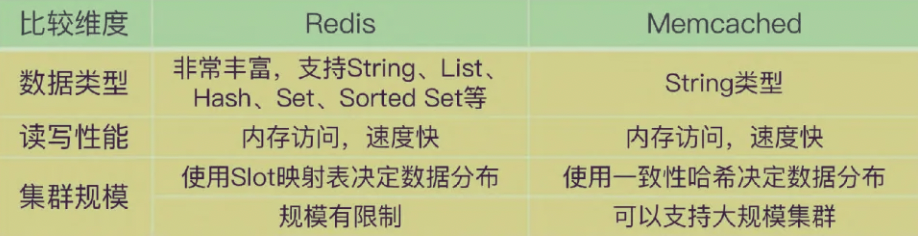

# 概念与应用

### redis是什么

> Redis（Remote Dictionary Server）是一个开源的高性能键值对（Key-Value）数据库。它通常用作数据库、缓存和消息传递系统。

本质上，redis就是一个用C语言编写的软件，运行在一台有物理内存支持的主机上，通过具体的[<mark style="color:red;">**内存申请**</mark>](#user-content-fn-1)[^1]算法，向操作系统申请物理内存，并使用内存进行数据读写的程序。


Redis的主要特点包括：

1. **速度**：Redis非常快速，因为它的数据存储在内存中。
2. **持久性**：支持数据持久化，可以将内存中的数据保存到磁盘，防止数据丢失。
3. **复制**：支持主从复制，提供数据的冗余和故障转移。
4. **高可用性**：通过Sentinel系统提供高可用性解决方案。
5. **分片**：通过Cluster模式支持数据分片，实现水平扩展。
6. **事务**：支持事务，可以保证操作的原子性。
7. **多种数据结构**：支持丰富的数据结构，适用于各种不同的用例。
8. **发布/订阅**：支持发布和订阅消息模式。
9. **Lua脚本**：支持Lua脚本，可以在服务器端执行复杂的逻辑。


### redis实例与节点

通常，在单机环境下[^2]，都称**实例**，也就是一个运行着redis软件的主机的描述。而节点通常都是在分布式环境下[^3]使用的概念。

在Redis集群中，有两种类型的节点：主节点（Master）和从节点（Slave）。主节点负责处理写操作，而从节点则用于复制主节点的数据，以提供读取操作的负载均衡和数据备份。

通常来说，每个节点可以是一个Redis实例。一个主节点可以有多个从节点，形成主从复制关系。这种关系是基于配置实现的。


* 集群模式

通常有两种模式，官方的redis cluster 和三方的codis。早期官方集群版本未出现时候，codis就是基于redis 3.x版本进行整合设计出的一套集群模式。

```
// 单机模式
127:6379> info server
# Server
redis_version:3.2.12
redis_git_sha1:00000000
redis_git_dirty:0
redis_build_id:b2d74fe5fff7657d
redis_mode:standalone

// 集群模式
127:6379> info server
# Server
redis_version:5.2.0
redis_git_sha1:b3508c22
redis_git_dirty:0
redis_build_id:62c12482ef6fcb98
redis_mode:cluster
```


* 集群节点通信

1. 对于cluster模式：Redis集群中的每个节点都通过特定的端口（默认是节点端口号+10000）进行通信，交换集群信息。每个节点都保存着其他节点的slots分配情况，并且通过<mark style="color:red;">**Gossip协议**</mark>相互交互集群信息。
2. 对于codis模式：节点实例都是直接与codis proxy进行连接管理。


### 重大版本更新特性

* Redis 4.0+版本引入了一些重大更新：

1. **模块系统（Modules API）**：Redis 4.0中最大的变化之一是加入了模块系统，这允许用户通过自己编写的代码来扩展Redis的功能。模块系统提供了一个API，允许开发者添加新的操作到现有数据类型、引入新的数据类型，或者扩展Redis的新进程，如搜索或神经网络等功能。
2. **PSYNC 2.0**：新版本的PSYNC命令解决了旧版本Redis在复制时的一些不够优化的地方，包括在从服务器FAILOVER后成为新的主节点时，以及其他从节点复制这个新主节点时，条件允许的情况下使用部分复制。
3. **缓存驱逐策略优化**：<mark style="color:red;">Redis 4.0添加了Last Frequently Used（LFU）缓存驱逐策略</mark>，这是一种新的算法，用于在达到maxmemory限制时驱逐键。LFU缓存提供了比LRU（Least Recently Used）缓存更好的命中率。
4. **异步删除操作（Lazy Free）**：Redis 4.0引入了异步删除操作，如UNLINK命令，它是DEL命令的异步版本，可以避免服务器在删除大键时阻塞。
5. **交换数据库（SWAPDB）**：Redis 4.0新增了SWAPDB命令，允许互换两个数据库的内容。
6. **混合持久化（RDB-AOF）**：Redis 4.0新增了RDB-AOF混合持久化格式，这是一个可选的功能，可以在AOF重写时同时包含RDB格式的内容和AOF格式的内容，结合了RDB和AOF持久化的优点。
7. **内存命令（MEMORY）**：Redis 4.0新添加了一个MEMORY命令，用于检查内存使用情况并进行内存管理操作。
8. **自动内存碎片整理（Active Defrag）**：Redis 4.0支持自动内存碎片整理，通过一系列配置选项进行设置。
9. **其他改进**：包括Redis Cluster的故障检测方式改变，慢日志记录客户端来源IP地址等

* Redis 6.0+版本特性，重大更新

1.  从单线程处理网络请求到多线程处理： 在6.0版本之前，对于从**网络IO处理到实际的读写命令处理，都是由单个线程完成**的。

    网络硬件的性能提升，Redis的性能瓶颈有时会出现在网络IO的处理上，单个主线程处理网络请求的速度跟不上底层网络硬件的速度。
2.  客户端缓存

    实现了服务端协助的客户端缓存功能，也称为<mark style="color:red;">**跟踪（Tracking）**</mark>**功能**。

    有了这个功能，业务应用中的Redis**客户端就可以把读取的数据缓存在业务应用本地**了，应用就可以直接在本地快速读取数据了。
3.  细粒度的权限控制

    对于一些高风险的命令（例如KEYS、FLUSHDB、FLUSHALL等），在Redis 6.0 之前，我们也只能通过rename-command来重新命名这些命令，避免客户端直接调用。
4.  新的RESP协议

    在<mark style="color:red;">**RESP2中**</mark><mark style="color:red;">，客户端和服务器端的通信内容都是以</mark><mark style="color:red;">**字节数组形式进行编码**</mark><mark style="color:red;">的</mark>，客户端需要根据操作的命令或是数据类型自行对传输的数据进行解码，增加了客户端开发复杂度。

    RESP 3直接**支持多种数据类型的区分编码**，包括空值、浮点数、布尔值、有序的字典集合、无序的集合等。


### 同类技术

* Redis和Memcached的比较

和Redis相似，Memcached也经常被当做缓存来使用。不过，Memcached有一个明显的优势，就是它的集群规模可以很大。

Memcached集群并不是像Redis Cluster或Codis那样，使用Slot映射来分配数据和实例的对应保存关系，而是使用一致性哈希算法把数据分散保存到多个实例上，而一致性哈希的优势就是可以支持大规模的集群。

另一方面，Memcached支持的数据类型比Redis少很多。<mark style="color:red;">**Memcached只支持String类型的键值对**</mark>，而Redis可以支持包括String在内的多种数据类型，当业务应用有丰富的数据类型要保存的话，使用Memcached作为替换方案的优势就没有了。

<figure><figcaption></figcaption></figure>

* Redis和RocksDB的比较

RocksDB可以把数据直接保存到硬盘上。这样一来，单个RocksDB可以保存的数据量要比Redis多很多，而且数据都能持久化保存下来。

RocksDB还能支持表结构[^4]（即列族结构），而Redis的基本数据模型就是键值对。

RocksDB毕竟是要把数据写入底层硬盘进行保存的，而且在进行 数据查询时，如果RocksDB要读取的数据没有在内存中缓存，那么，RocksDB就需要到硬盘上的文件中进行查找，这会拖慢RocksDB的读写延迟，降低带宽。

<figure><figcaption></figcaption></figure>


[^1]: 

    Redis使用不同的内存分配器来管理内存，默认情况下使用`jemalloc`，它是一种高效的内存分配器，能够减少内存碎片并提高多线程性能。Redis也支持其他内存分配器，如`glibc`和`tcmalloc`，用户可以根据需求选择合适的分配器。

[^2]: 就是只有一台独立的主机安装了redis

[^3]: 就是有多个不同的主机上，都运行着redis软件

[^4]: 需要一个大容量的持久化键值数据库，并且能按照一定表结构保存数据，RocksDB是一个不错的替代方案。
